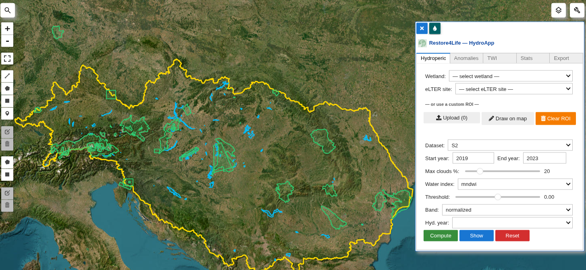
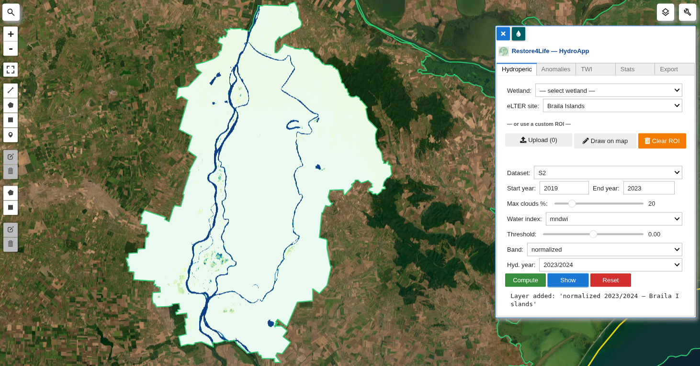
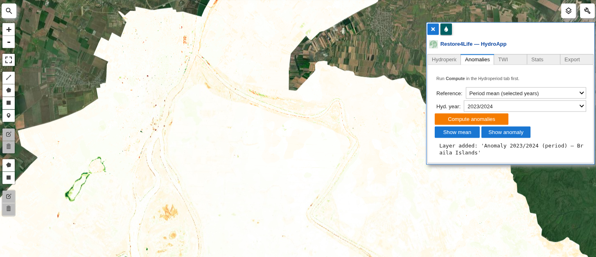
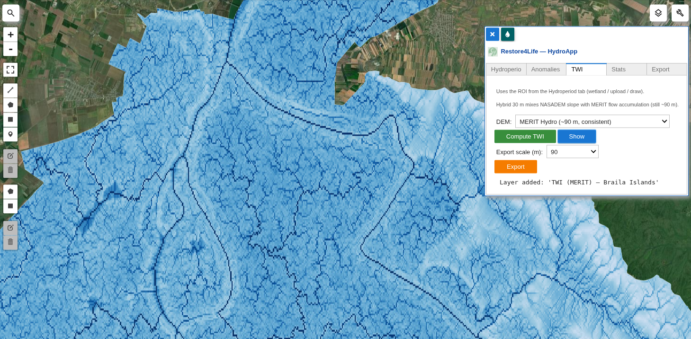
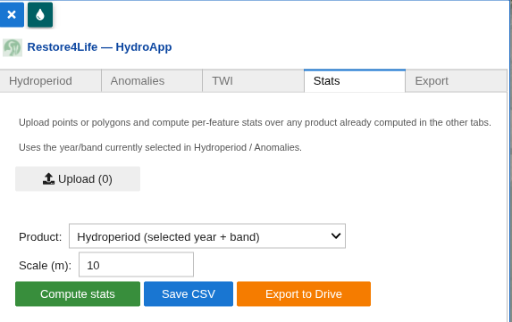

# Restore4Life — HydroApp: Feature Reference

Interactive `leafmap`/`geemap` widget for hydroperiod analysis of Danube basin wetlands. Uses [`ndvi2gif`](https://github.com/Digdgeo/Ndvi2Gif) (`NdviSeasonality` + `HydroperiodAnalyzer`) as the computation backend on Google Earth Engine.

Entry point: `restore4life.HydroperiodApp(Map)` — injects a collapsible panel (top-right corner of the map) with 5 tabs.



---

## 1. Base map and context layers

On initialization against a `geemap` map:

- **Basemap**: `Esri.WorldImagery` (satellite imagery).
- **Danube Basin** (`DRBD_2021.shp`): basin outline in gold, no fill. Also used to:
  - Center the map (`fit_bounds` on the basin extent).
  - Constrain pan/zoom (`max_bounds` + `min_zoom = 5`) — users cannot pan outside the basin.
- **Wetlands** (`humedales_danubio.shp`): Danube wetlands in translucent blue.
- **eLTER sites (Danube)** (`elter_danube.geojson`, optional): eLTER sites intersecting the basin, in green. Built/refreshed via `scripts/build_elter_danube.py` (queries DEIMS-SDR).

All layers are loaded locally as GeoJSON — no EE round-trips at startup.

---

## 2. ROI (region of interest) selection

Four mutually exclusive ways to define the ROI:

| Method | How |
|---|---|
| **Wetland dropdown** | Alphabetic list from `humedales_danubio.shp` (name column auto-detected). |
| **eLTER dropdown** | eLTER sites filtered by intersection with the basin. |
| **Upload** | Accepts `.geojson`, `.json`, or `.zip` (shapefile bundle). Reprojected to EPSG:4326. |
| **Draw on map** | The *Draw on map* button enables `DrawControl` for polygon or rectangle. |

The **Clear ROI** button resets the selection, drawings, and dropdowns. Selecting one source automatically clears the others.

---

## 3. **Hydroperiod** tab — main computation

Computation settings:

- **Dataset**: Sentinel-2 (from 2017), Landsat (from 1984), MODIS (from 2000). Changing the dataset adjusts the minimum years, the available water indices, and the default export scale.
- **Start/End year**: hydrological year range.
- **Max clouds %**: cloud filter (0–100 slider).
- **Water index** (sensor-dependent):
  - S2 / Landsat: `mndwi`, `ndwi`, `awei`, `aweinsh`, `wi2015`
  - MODIS: `mndwi`, `ndwi`
- **Threshold**: water/non-water binarization threshold (-1.0 to 1.0, step 0.01).
- **Band**: band to visualize after computation — `normalized`, `hydroperiod`, `valid_days`, `first_flood_doy`, `last_flood_doy`, `irt`.
- **Hyd. year**: auto-populated after *Compute* with the available cycles (format `YYYY/YYYY+1`).

Buttons:

- **Compute** — 3 phases: builds `NdviSeasonality` → `HydroperiodAnalyzer` → `compute_all_cycles(index, threshold)`. Produces one image per hydrological year.
- **Show** — adds the selected band of the selected year to the map, using a band-specific palette. For `irt`, it computes `compute_irt_image()` on demand and caches the result.
- **Reset** — clears state, computed layers, ROI, drawings, and dropdowns.



---

## 4. **Anomalies** tab

Requires a prior *Compute* run in the Hydroperiod tab.

- **Reference**:
  - `Period mean` — mean of the selected years in the current range.
  - `Historical` — mean of the sensor's full historical archive.
- **Compute anomalies** — calls `HydroperiodAnalyzer.compute_anomalies(cycles, reference)`, returns `{'mean': ee.Image, 'anomalies': {year: ee.Image}}`.
- **Show mean** — adds the reference mean to the map (palette `mean_hydroperiod`).
- **Show anomaly** — adds the anomaly for the selected year (diverging red→green palette, ±180 days range).



---

## 5. **TWI** tab (Topographic Wetness Index)

TWI = ln(a / tan β), where *a* = upstream accumulation area per unit contour length and *β* = local slope.

- **DEM source**:
  - `MERIT Hydro (~90 m)` — slope and accumulation both from MERIT, internally consistent.
  - `Hybrid 30 m` — NASADEM (30 m) for slope + MERIT `upa` reprojected for accumulation. Accumulation remains effectively ~90 m (true sink-filling + D8 at 30 m is not practical in GEE).
- **Compute TWI** — computes over the current ROI.
- **Show** — adds to the map with a blue palette (range 2–20).
- **Export to Drive** — exports the current TWI as a GeoTIFF. Configurable scale (30, 60, 90, 250, 500 m).



---

## 6. **Stats** tab — zonal statistics

Computes per-feature statistics over any product already computed in the other tabs.

- **Upload**: `.geojson` / `.json` / `.zip` with **points** or **polygons** (geometry type and name column auto-detected).
- **Product**:
  - `Hydroperiod (current year + band)`
  - `IRT`
  - `Mean hydroperiod` (from Anomalies)
  - `Anomaly` (current year in Anomalies)
  - `TWI`
- **Scale (m)**: sampling resolution. Auto-adjusts to product/sensor (TWI → 90 m, S2 → 10 m, Landsat → 30 m, MODIS → 500 m).
- **Reducer**:
  - Points → `first()` (pixel value).
  - Polygons → combination of `mean`, `median`, `min`, `max`, `stdDev`, `count`.

Buttons:

- **Compute stats** — runs `reduceRegions` and renders the resulting table in the panel (pandas DataFrame). Warns when the collection has >1000 features.
- **Save CSV** — writes `stats_YYYYMMDD_HHMMSS.csv` to the notebook's cwd.
- **Export to Drive** — server-side export via `ee.batch.Export.table.toDrive` (recommended for large datasets).



---

## 7. **Export** tab — export full cycle stack

- **Drive folder**: destination folder name on Google Drive (default `restore4life_hydroperiod`).
- **Scale (m)**: 10 / 20 / 30 / 100 / 250 / 500.
- **Export** — launches one `ee.batch.Export.image.toDrive` task per computed cycle (named `hydroperiod_<site>_<yyyy>_<yyyy+1>`).

---

## 8. UI — panel behavior

- Floating button with 💧 icon (`tint`) — top-right corner of the map.
- Expands on click or on mouse-over.
- ✕ button (`close`) hides the panel and removes the map control.
- Per-band color palettes are defined in the module's `_VIS` dictionary.

---

## 9. Required data at the repo root

| File | Description | Source |
|---|---|---|
| `DRBD_2021.shp` (+ .dbf/.prj/.shx/.cst) | Danube basin | provided |
| `humedales_danubio.shp` (+ sidecars) | Wetlands to analyse | provided |
| `elter_danube.geojson` | eLTER sites (optional) | generate via `scripts/build_elter_danube.py` |
| `logo.png` | Restore4Life logo (widget header) | provided |

---

## 10. Minimal usage

```python
import ee
import geemap
from restore4life import HydroperiodApp

ee.Initialize()

Map = geemap.Map()
HydroperiodApp(Map)
Map
```

See `notebooks/demo.ipynb` for a full walkthrough.
